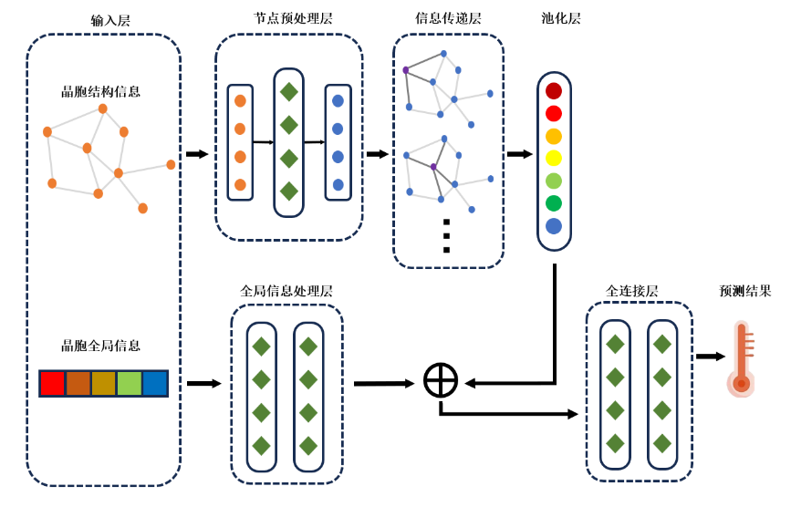

# Bi-SPGCN
本仓库为CG2407题目解决方案[Bi-SPGCN](#bi-spgcn)（Bi-level Superconductivity Prediction Graph Convolutional Network）

我们利用图神经网络以实现基于晶体结构信息的超导转变温度的预测，从有序结构、无序结构两方面分别构建神经网络模型，并针对赛题数据特殊性，引入迁移学习方法和处理样本不均衡问题等相关技术。

最终实验结果显示，本报告提出的模型框架和训练方法在R2和MAE准则下均优于现有模型（[BSGNN](https://github.com/GLinustb/BSGNN)）。


# 一、代码框架参考
1. 本仓库为基于[DeepGATGNN](https://github.com/usccolumbia/deeperGATGNN)与[MatDeepLearn](https://github.com/Fung-Lab/MatDeepLearn)框架所构建；
2. 环境版本要求请参考[requirement.txt](./requirements.txt)文件
3. 置信度计算我们使用R语言，相关计算、绘图代码与实例数据已放置于[Confidence](./Confidence/)文件夹中


# 二、模型训练与参数介绍
## 2.1 模型结构

Bi-SPGCN主要由晶胞特征提取与全局信息提取两部分组成，晶胞特征提取部分首先使用全连接层对每个节点特征进行预处理，获取节点特征向量后使用图卷积网络进行信息传递，并通过池化层获取图特征向量，与全局信息提取部分得到的全局信息特征进行拼接，最后经过全连接层获得转变温度预测结果。

## 2.2 主要参数介绍
模型运行参数文件请参考[config.yml](./config.yml)文件

### 1）部分重要参数介绍
- data_path 数据存放路径
- run_mode 运行模式
    - Repeat为重复试验模式
    - Predict为预测模式
- model 使用的模型
    - BiSPGCN
    - DEEP_GATGNN_demo
- batch_size 批处理大小
- epochs 训练轮数

- aug 是否进行数据扩充
- aug_stage 扩充位置
- aug_times 重复次数
- reprocess 是否重新预处理数据
- format 数据格式
- gc_count 图卷积层数
- pt 是否使用预训练嵌入损失
- info_fc_count 全局信息全连接层数

### 2）数据集
预处理后的数据集我们已存放于[./temp_data](./temp_data/)目录下，包含order与disorder部分


## 2.3 运行命令示范

训练命令可按照如下使用：
```bash
# Order
python main.py --data_path="temp_data/order_data" --run_mode="Repeat" --model="BiSPGCN" --batch_size="63"  --save_model="FALSE" --epochs="500" --aug="True"  --aug_times=5 --aug_stage=0.0  --reprocess="True"  --format="cif" --gc_count="10" --pt="True"

# Disorder
python main.py --data_path="temp_data/disorder_data" --run_mode="Repeat" --model="DEEP_GATGNN_demo" --batch_size="31"  --save_model="FALSE" --epochs="500" --aug="True"  --aug_times=2 --aug_stage=0.0  --reprocess="True"  --format="cif" --gc_count="15"
```

# 三、模型结果对比

- **消融实验结果 Order**

|Model|	Train MAE|	Train R2|Val MAE|	Val R2	|Test MAE|	Test R2|
|---|---|---|---|---|---|---|
|no ag pt gf|	1.25±0.15	|0.99±0.00	|5.61±0.25	|0.78±0.04	|7.12±0.34	|0.84±0.02|
|no pt gf	|2.27±0.68	|0.96±0.01	|5.88±0.02	|0.72±0.04	|6.67±0.25	|0.82±0.02
|no pt	|1.73±0.88	|0.98±0.02	|5.76±0.41	|0.81±0.04	|5.90±0.70	|0.90±0.03
|with all	|1.55±0.40	|0.99±0.01	|5.52±0.29	|0.83±0.03	|4.89±0.34	|0.95±0.02|

- **模型对比结果 Order**

|Model	|Train MAE	|Train R2	|Val MAE	|Val R2	|Test MAE	|Test R2
|---|---|---|---|---|---|---|
|BSGNN	|3.96±0.45	|0.90±0.03	|6.33±0.29	|0.68±0.02	|5.91±0.33	|0.87±0.02
|Bi-SPGCN	|1.55±0.40	|0.99±0.01	|5.52±0.29	|0.83±0.03	|4.89±0.34	|0.95±0.02